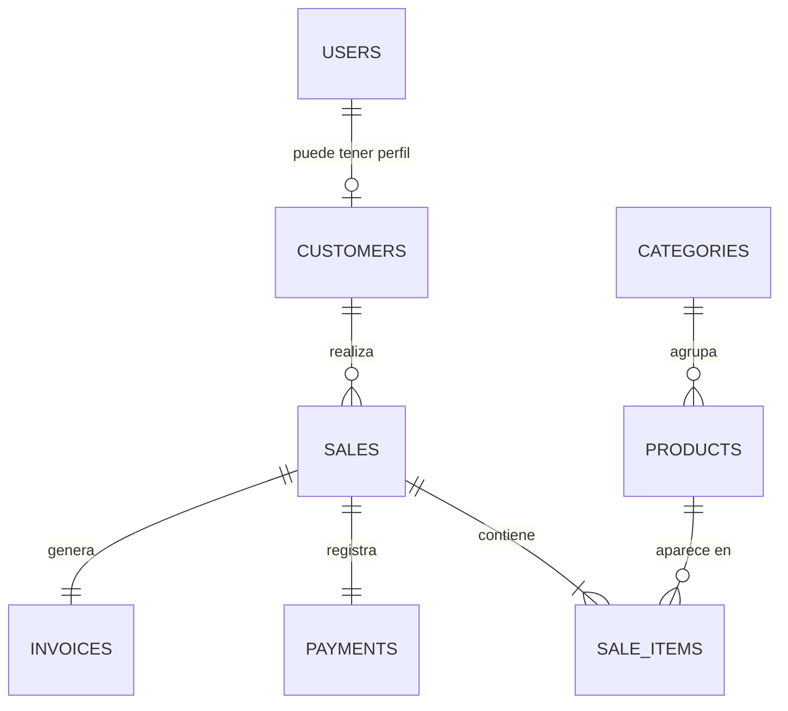

# NexusPOS

NexusPOS es una aplicación web full stack para vender productos tecnológicos y periféricos. Incluye catálogo público con JWT de invitado, cuentas de cliente, carrito, checkout seguro, pago simulado, control de inventario, ventas, facturación y un panel administrativo con métricas.

## Características

### Cliente e invitado

- Navegación sin cuenta mediante un JWT temporal con rol `Guest`.
- Registro e inicio de sesión con JWT.
- Catálogo con búsqueda, categorías, ordenamiento y paginación desde backend.
- Detalle de producto y carrito persistido localmente.
- Checkout con precios, impuestos y stock recalculados por el servidor.
- Pago local aprobado o rechazado mediante `MockPaymentGateway`.
- Historial de compras y factura imprimible.
- Estados de carga, error, vacío y éxito.

### Administración

- Dashboard semanal, mensual y anual.
- Ingresos, ventas, clientes, unidades vendidas y ticket promedio.
- Serie de ingresos, productos destacados, stock bajo y ventas recientes.
- Creación, edición y desactivación de productos.
- Gestión de categorías.
- Inventario, clientes, ventas y facturas.

## Arquitectura

El backend es un monolito modular desplegado como una sola API:

```text
backend/
├── src/
│   ├── NexusPOS.Api             HTTP, controllers, middleware y Swagger
│   ├── NexusPOS.Application     Contratos, DTOs y reglas de precios
│   ├── NexusPOS.Domain          Entidades, enums y excepciones de negocio
│   └── NexusPOS.Infrastructure  EF Core, MySQL, JWT, pagos y casos de uso
└── tests/
    ├── NexusPOS.UnitTests
    └── NexusPOS.IntegrationTests
```

El frontend utiliza una organización orientada a funcionalidades:

```text
frontend/src/
├── api/
├── components/
├── features/
│   ├── auth/
│   └── cart/
├── layouts/
├── pages/
│   └── admin/
├── types/
└── utils/
```

```text
Navegador → React/Nginx → ASP.NET Core API → MySQL
```

## Tecnologías

- .NET 10 y ASP.NET Core Web API
- Entity Framework Core 10
- MySQL 8.4 LTS y `MySql.EntityFrameworkCore`
- JWT Bearer y `PasswordHasher<TUser>`
- Swagger/OpenAPI
- React 19, TypeScript y Vite
- TanStack Query, Axios, Recharts y Lucide
- xUnit, FluentAssertions y `WebApplicationFactory`
- Docker, Docker Compose y Nginx

## Requisitos previos

- .NET SDK 10.0.400 o compatible
- Node.js 24 LTS y npm 11+
- Docker Desktop con Docker Compose
- Git

No es necesario instalar MySQL localmente si se utiliza Docker.

## Configuración

Clona el repositorio y crea el archivo local de variables:

```bash
git clone https://github.com/L4M4rck/NexusPOS.git
cd NexusPOS
cp .env.example .env
```

En PowerShell:

```powershell
Copy-Item .env.example .env
```

Cambia las contraseñas y `JWT_SECRET`. El secreto JWT debe contener al menos 32 caracteres. `.env` está excluido de Git.

## Variables de entorno

| Variable | Propósito |
|---|---|
| `MYSQL_DATABASE` | Nombre de la base de datos |
| `MYSQL_USER` | Usuario de aplicación MySQL |
| `MYSQL_PASSWORD` | Contraseña del usuario MySQL |
| `MYSQL_ROOT_PASSWORD` | Contraseña administrativa local de MySQL |
| `JWT_SECRET` | Clave de firma JWT, mínimo 32 caracteres |
| `JWT_ISSUER` | Emisor esperado del token |
| `JWT_AUDIENCE` | Audiencia esperada del token |
| `JWT_EXPIRATION_MINUTES` | Duración de JWT autenticados |
| `SEED_ADMIN_EMAIL` | Correo del administrador de desarrollo |
| `SEED_ADMIN_PASSWORD` | Contraseña del administrador de desarrollo |
| `SEED_CUSTOMER_PASSWORD` | Contraseña de clientes sembrados |
| `VITE_API_URL` | URL base de la API para desarrollo frontend |

ASP.NET Core admite las variantes con doble guion bajo, por ejemplo `Jwt__Secret` y `ConnectionStrings__DefaultConnection`.

## Ejecutar con Docker

```bash
docker compose up --build
```

Servicios:

| Servicio | URL/puerto |
|---|---|
| Frontend | http://localhost:3000 |
| API | http://localhost:8080 |
| Swagger | http://localhost:8080/swagger |
| Health | http://localhost:8080/health |
| MySQL | localhost:3306 |

Detener contenedores:

```bash
docker compose down
```

Eliminar también la base de datos local:

```bash
docker compose down -v
```

`down -v` borra el volumen de MySQL y sus datos; úsalo solamente cuando quieras reiniciar el entorno.

## Ejecutar manualmente

### MySQL

```bash
docker compose up mysql -d
```

La conexión de desarrollo predeterminada corresponde a los valores de `.env.example`.

### Backend

```bash
dotnet tool restore
dotnet restore NexusPOS.slnx --configfile NuGet.Config
dotnet build NexusPOS.slnx
dotnet run --project backend/src/NexusPOS.Api
```

La API se publica en `http://localhost:8080` con el perfil de desarrollo.

### Frontend

```bash
cd frontend
npm install
npm run dev
```

Build de producción:

```bash
npm run build
```

### Entorno de desarrollo completo

Windows PowerShell:

```powershell
./scripts/dev.ps1
```

Linux/macOS:

```bash
chmod +x scripts/dev.sh
./scripts/dev.sh
```

Los scripts levantan MySQL, ejecutan la API y abren Vite en modo desarrollo.

## Base de datos

NexusPOS utiliza **MySQL 8.4** como motor relacional y **Entity Framework Core
10** con un enfoque Code First. El modelo se define en
`NexusPosDbContext` y en las entidades de `NexusPOS.Domain`; las migraciones
versionadas convierten ese modelo en el esquema físico de MySQL.

### Modelo relacional



| Tabla | Clave y relaciones | Información almacenada |
|---|---|---|
| `Users` | PK `Id`; relación opcional 1:1 con `Customers` | Nombre, correo, hash de contraseña, rol, estado y fechas de creación/actualización |
| `Customers` | PK `Id`; FK única `UserId` → `Users.Id` | Documento, teléfono, dirección y fecha de registro |
| `Categories` | PK `Id` | Nombre, descripción, imagen y estado activo |
| `Products` | PK `Id`; FK `CategoryId` → `Categories.Id` | SKU, nombre, descripción, precio, stock, imagen, estado y fechas de auditoría |
| `Sales` | PK `Id`; FK `CustomerId` → `Customers.Id` | Clave de idempotencia, número de factura, subtotal, IVA, descuento, total, estado y fecha |
| `SaleItems` | PK `Id`; FK `SaleId` → `Sales.Id`; FK `ProductId` → `Products.Id` | Cantidad y snapshots del nombre y precio del producto vendido |
| `Payments` | PK `Id`; FK única `SaleId` → `Sales.Id` | Proveedor, referencia externa, monto, moneda, estado y fecha de procesamiento |
| `Invoices` | PK `Id`; FK única `SaleId` → `Sales.Id` | Número, fecha y snapshots del nombre y documento del cliente |

Los *snapshots* de `SaleItems` e `Invoices` preservan la información histórica:
una factura emitida no cambia si después se modifica el producto o el perfil del
cliente.

### Integridad e índices

- Son únicos el correo del usuario, documento del cliente, nombre de categoría,
  SKU, número de venta/factura y referencia del proveedor de pagos.
- La combinación `Sales.CustomerId + Sales.IdempotencyKey` es única para impedir
  ventas duplicadas cuando una solicitud se reintenta.
- `Payments.SaleId` e `Invoices.SaleId` son únicos y materializan relaciones 1:1
  con la venta.
- MySQL exige `Products.Price > 0` y `Products.Stock >= 0` mediante restricciones
  `CHECK`.
- Los importes monetarios usan `decimal(18,2)`, los estados y roles se guardan
  como texto, y la base utiliza el juego de caracteres `utf8mb4`.
- Existen índices para las consultas por categoría/estado, fechas de creación y
  relaciones entre ventas, productos y clientes.
- Las entidades dependientes se eliminan en cascada con su agregado. La relación
  `SaleItems.ProductId` usa `RESTRICT` para impedir que se borre un producto que
  ya forma parte del historial de ventas.

### Ejecución y persistencia en Docker

Docker Compose ejecuta la base en el servicio `mysql` usando la imagen
`mysql:8.4`. El puerto local `3306` se publica para tareas de desarrollo y los
datos se conservan en el volumen nombrado `mysql-data`. El backend espera a que
el *healthcheck* de MySQL sea satisfactorio antes de iniciar.

Durante el arranque, `DbInitializer` realiza este proceso:

1. Aplica las migraciones pendientes mediante `Database.MigrateAsync()`.
2. Completa imágenes de categorías creadas antes de la migración correspondiente.
3. Ejecuta el seed de desarrollo solo cuando la tabla `Users` está vacía.

Detener los contenedores con `docker compose down` conserva el volumen. Usar
`docker compose down -v` elimina `mysql-data` y, por tanto, toda la información
local de la base de datos.

## Migraciones

Las migraciones se encuentran versionadas en
`backend/src/NexusPOS.Infrastructure/Persistence/Migrations`. Actualmente,
`InitialCreate` crea las ocho tablas, relaciones, índices y restricciones;
`AddCategoryImage` incorpora `Categories.ImageUrl`.

Crear una migración nueva:

```bash
dotnet ef migrations add NombreMigracion \
  --project backend/src/NexusPOS.Infrastructure \
  --startup-project backend/src/NexusPOS.Api \
  --output-dir Persistence/Migrations
```

Aplicarla manualmente:

```bash
dotnet ef database update \
  --project backend/src/NexusPOS.Infrastructure \
  --startup-project backend/src/NexusPOS.Api
```

Al iniciar, la API aplica migraciones pendientes y después ejecuta el seed de manera idempotente.

## Seed y credenciales de desarrollo

Estas credenciales existen exclusivamente para desarrollo local y pueden cambiarse mediante variables:

| Rol | Correo | Contraseña predeterminada |
|---|---|---|
| Admin | `admin@nexuspos.local` | `Admin123!` |
| Customer | `laura@nexuspos.local` | `Customer123!` |
| Customer | `carlos@nexuspos.local` | `Customer123!` |
| Customer | `ana@nexuspos.local` | `Customer123!` |

También se crean cinco categorías y quince productos.

## API y Swagger

Los únicos endpoints anónimos son:

```text
POST /api/auth/guest
POST /api/auth/login
POST /api/auth/register
GET  /health
```

El resto requiere un JWT. En Swagger selecciona **Authorize** e ingresa únicamente el token; Swagger agrega el esquema Bearer.

Endpoints principales:

```text
GET    /api/products
GET    /api/products/{id}
POST   /api/products                     Admin
PUT    /api/products/{id}                Admin
PATCH  /api/products/{id}/status         Admin
GET    /api/categories
POST   /api/categories                   Admin
PUT    /api/categories/{id}              Admin
POST   /api/checkout                     Customer
GET    /api/sales                        Customer/Admin
GET    /api/invoices                     Customer/Admin
GET    /api/invoices/{id}                Propietario/Admin
GET    /api/admin/dashboard              Admin
GET    /api/customers                    Admin
```

## Seguridad

- Contraseñas procesadas con `PasswordHasher<TUser>`; nunca se almacenan en texto plano.
- JWT firmado con secreto externo, emisor, audiencia, expiración y `ClockSkew` de 30 segundos.
- Claims limitados a identificador, correo y rol.
- Autorización de roles aplicada en backend.
- DTOs separados de las entidades EF Core.
- Consultas parametrizadas por Entity Framework Core.
- ProblemDetails uniforme y sin stack traces para el cliente.
- CORS limitado a orígenes configurados.
- No se registran contraseñas, tokens ni datos de tarjeta.
- Productos históricos se desactivan mediante `IsActive`; no se borran físicamente.

## Autoridad de precios

> El frontend nunca determina el precio final de una venta. Todos los cálculos son realizados nuevamente en backend utilizando los precios almacenados en la base de datos.

El request de checkout solamente acepta identificador y cantidad:

```json
{
  "idempotencyKey": "3e3bf2a4-89bf-4ae9-bd67-392d82ae5a3f",
  "paymentMethod": "mock-approved",
  "items": [
    { "productId": 1, "quantity": 2 }
  ]
}
```

La API recupera los productos activos y calcula `UnitPrice`, `Subtotal`, `Tax`, `Discount` y `Total`. Las propiedades monetarias adicionales enviadas por un navegador manipulado se ignoran.

## Ventas, inventario e idempotencia

1. Se valida el cliente y la clave de idempotencia.
2. Se consolidan productos repetidos.
3. Se consultan precios y existencias actuales.
4. Se reserva inventario mediante actualización condicional `Stock >= Quantity`.
5. Se procesa el pago simulado.
6. Se persisten venta, detalles, pago y factura en una transacción.
7. Se confirma la transacción.

La actualización condicional evita stock negativo incluso con compradores concurrentes. El índice único `(CustomerId, IdempotencyKey)` y la consulta previa evitan ventas duplicadas por doble clic o reintentos.

El mock se ejecuta dentro de la frontera transaccional porque no realiza una llamada de red. Para un proveedor real se recomienda autorización/captura, compensación e inbox/outbox sin mantener una transacción de base de datos durante una llamada externa.

## Pagos

`IPaymentGateway` desacopla la aplicación de un proveedor concreto. Los valores locales son:

```text
mock-approved → pago aprobado
mock-rejected → pago rechazado
```

No se solicitan ni almacenan números de tarjeta o CVV. Una integración real debe utilizar tokens creados por el SDK seguro del proveedor.

## Facturación

Una compra exitosa genera números con el formato:

```text
FV-2026-000001
```

Los detalles conservan nombre y precio como snapshots; cambiar un producto no modifica facturas históricas. Un cliente solo puede consultar sus propios documentos y el administrador puede consultar todos.

## Pruebas

Backend:

```bash
dotnet test NexusPOS.slnx
```

Frontend:

```bash
cd frontend
npm test
npm run lint
```

Las pruebas cubren cálculo monetario, precio de base de datos frente a precio manipulado, stock, pagos rechazados, idempotencia, JWT de invitado, roles, dashboard y privacidad de facturas.

## Estructura del proyecto

```text
NexusPOS/
├── .config/dotnet-tools.json
├── backend/
│   ├── Dockerfile
│   ├── src/
│   └── tests/
├── frontend/
│   ├── Dockerfile
│   ├── nginx.conf
│   └── src/
├── scripts/
│   ├── dev.ps1
│   └── dev.sh
├── docker-compose.yml
├── NexusPOS.slnx
└── .env.example
```
## Decisiones técnicas

- Monolito modular para mantener transacciones simples y despliegue único.
- Servicios de aplicación expuestos como interfaces; EF Core permanece en Infrastructure.
- `decimal(18,2)` para dinero y COP como moneda predeterminada.
- Paginación y agregaciones resueltas en backend.
- Mock de pagos inyectable para desarrollo reproducible.
- Facturas persistidas con snapshots históricos.
- React Query para estado remoto y Context únicamente para sesión/carrito.
- Lazy loading de rutas para separar el bundle administrativo y Recharts.

## Mejoras futuras

- Integración con Stripe/Wompi en sandbox mediante tokenización.
- PDF firmado y almacenamiento de documentos.
- Refresh tokens con rotación y revocación.
- Reserva de inventario con expiración para gateways asíncronos.
- Descuentos y reglas tributarias configurables por producto.
- Auditoría administrativa y trazabilidad de cambios.
- Pruebas end-to-end con Playwright.
- Observabilidad con OpenTelemetry.

## Licencia

NexusPOS no se distribuye bajo ninguna licencia de código abierto o de uso
público. Copyright © 2026 Marco Acosta. Todos los derechos reservados. Consulta
[LICENSE](LICENSE) para conocer las restricciones aplicables. Las dependencias
de terceros conservan sus respectivas licencias y condiciones.
